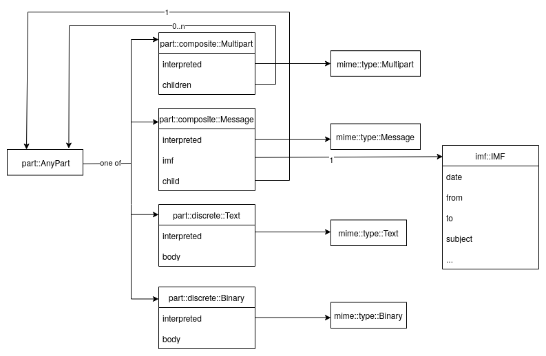

# eml-codec

**⚠️ This is currently only a decoder (ie. a parser), encoding is not yet implemented.**

`eml-codec` is a child project of [Aerogramme](https://aerogramme.deuxfleurs.fr), a distributed and encrypted IMAP server developped by the non-profit organization [Deuxfleurs](https://deuxfleurs.fr).
Its aim is to be a swiss army knife to handle emails, whether it is to build an IMAP/JMAP server, a mail filter (like an antispam), or a mail client.

## Example

```rust
let input = br#"Date: 7 Mar 2023 08:00:00 +0200
From: deuxfleurs@example.com
To: someone_else@example.com
Subject: An RFC 822 formatted message
MIME-Version: 1.0
Content-Type: text/plain; charset=us-ascii

This is the plain text body of the message. Note the blank line
between the header information and the body of the message."#;

let email = eml_codec::email(input).unwrap();
println!(
    "{} just sent you an email with subject \"{}\"",
    email.imf.from[0].to_string(),
    email.imf.subject.unwrap().to_string(),
);
```

[See more examples in the examples/ folder](./examples/)

## About the name

This library does not aim at implementing a specific RFC, but to be a swiss-army knife to decode and encode ("codec") what is generaly considered an email (generally abbreviated "eml"), hence the name: **eml-codec**.

## Goals

- Maintainability - modifying the code does not create regression and is possible for someone exterior to the project.
- Compatibility - always try to parse something, do not panic or return an error.
- Exhaustivity - serve as a common project to encode knowledge about emails (existing mime types, existing headers, etc.).

[See more about this library goals in the doc/ folder](./doc/goals.md)

## Missing / known bugs

Current known limitations/bugs:

 - Resent Header Fields are not implemented
 - Return-Path/Received headers might be hard to use as their order is important, and it's currently lost in the final datastructure.
 - Datetime parsing of invalid date might return `None` instead of falling back to the `bad_body` field
 - Comments contained in the email headers are dropped during parsing
 - No support is provided for message/external-body (read data from local computer) and message/partial (aggregate multiple fragmented emails) as they seem obsolete and dangerous to implement.

## Design

High-level overview of the datastructures (inspired by the UML class diagram conventions):



## Testing strategy

Currently this crate has some unit tests on most of its parsing functions.
It is also tested as part of Aerogramme, its parent project where it handles email parsing.
In this project,  `eml-codec` parsing capabilities are compared to Dovecot, Cyrus, Maddy and other IMAP servers.

It is planned to test it on large email datasets (like Enron, jpbush, mailing lists, etc.) but it's not done yet.
Fuzzing the library would also be interesting, probably to detect crashing due to stack overflow for example
due to the infinite recursivity of MIME.

## RFC and IANA references

RFC

| 🚩 | # | Name |
|----|---|------|
| 🟩 |822	| ARPA INTERNET TEXT MESSAGES| 
| 🟩 |2822	| Internet Message Format (2001) | 	
| 🟩 |5322	| Internet Message Format (2008) | 	
| 🟩 |2045	| ↳ Multipurpose Internet Mail Extensions (MIME) Part One: Format of Internet Message Bodies |
| 🟩 |2046	| ↳ Multipurpose Internet Mail Extensions (MIME) Part Two: Media Types | 
| 🟩 |2047	| ↳ MIME (Multipurpose Internet Mail Extensions) Part Three: Message Header Extensions for Non-ASCII Text | 
| 🟩 |2048	| ↳ Multipurpose Internet Mail Extensions (MIME) Part Four: Registration Procedures | 
| 🟩 |2049	| ↳ Multipurpose Internet Mail Extensions (MIME) Part Five: Conformance Criteria and Examples |
|    |      | **Headers extensions** |
| 🔴 |2183  | ↳ Communicating Presentation Information in Internet Messages: The Content-Disposition Header Field |
| 🔴 |6532	| ↳ Internationalized Email Headers |
| 🔴 |9228  | ↳ Delivered-To Email Header Field |
|    |      | **MIME extensions** |
| 🔴 |1847  | ↳ Security Multiparts for MIME: Multipart/Signed and Multipart/Encrypted |
| 🔴 |2387  | ↳ The MIME Multipart/Related Content-type |
| 🔴 |3462  | ↳ The Multipart/Report Content Type for the Reporting of Mail System Administrative Messages |
| 🔴 |3798  | ↳ Message Disposition Notification |
| 🔴 |6838  | ↳ Media Type Specifications and Registration Procedures |

IANA

| Name | Description | Note |
|------|-------------|------|
| [Media Types](https://www.iana.org/assignments/media-types/media-types.xhtml) | Registered media types for the Content-Type field | Currently only the media types in the MIME RFC have dedicated support in `eml-codec`. |
| [Character sets](https://www.iana.org/assignments/character-sets/character-sets.xhtml) | Supported character sets for the `charset` parameter | They should all be supported through the `encoding_rs` crate |

## State of the art / alternatives

*The following review is not an objective, neutral, impartial review. Instead, it's a temptative 
to explain why I wrote this 

`stalwartlab/mail_parser`

[See more about this library goals in the sota/ folder](./doc/sota.md)

## Support

`eml-codec`, as part of the [Aerogramme project](https://nlnet.nl/project/Aerogramme/), was funded through the NGI Assure Fund, a fund established by NLnet with financial support from the European Commission's Next Generation Internet programme, under the aegis of DG Communications Networks, Content and Technology under grant agreement No 957073.


## License

```
eml-codec
Copyright (C)  The eml-codec Contributors

This program is free software: you can redistribute it and/or modify
it under the terms of the GNU General Public License as published by
the Free Software Foundation, either version 3 of the License, or
(at your option) any later version.

This program is distributed in the hope that it will be useful,
but WITHOUT ANY WARRANTY; without even the implied warranty of
MERCHANTABILITY or FITNESS FOR A PARTICULAR PURPOSE.  See the
GNU General Public License for more details.

You should have received a copy of the GNU General Public License
along with this program.  If not, see <http://www.gnu.org/licenses/>.
```
